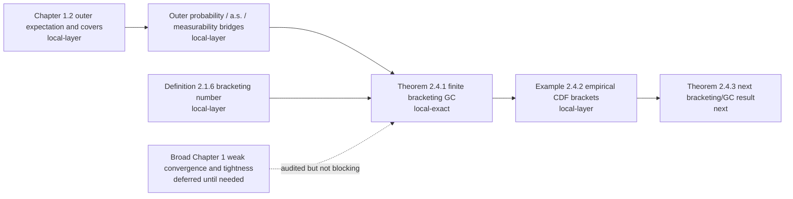

# VdV&W Chapter 1-2 Progress Dashboard

This dashboard is a quick visual view of the current formalization state for
van der Vaart and Wellner Chapters 1 and 2.  The authoritative detailed
inventory is `docs/vdvw_chapter1_2_formalization_blueprint.md`; this file is a
human-facing monitor for what is proved, what is in progress, and what remains.

Status snapshot date: 2026-05-02.

## Status Legend

| Status | Meaning |
| --- | --- |
| `local-exact` | The exact textbook theorem/lemma target is formalized and proved in Lean with no proof holes. |
| `local-layer` | A compiled local proof layer exists, but the exact textbook item still has compatibility gaps. |
| `mathlib-foundation` | Pinned mathlib has reusable foundations, but the exact VdV&W statement is not locally proved. |
| `pending-local` | No exact local Lean proof yet. |
| `deferred` | Audited, but not a near-term blocker unless a concrete empirical-process theorem depends on it. |

## Global Theorem-Level Inventory

The Chapter 1-2 theorem-level extraction currently has 156 items.

```text
local-exact       1 / 156  [#-----------------------------]
local-layer       7 / 156  [#-----------------------------]
mathlib-found.   21 / 156  [####--------------------------]
pending-local   127 / 156  [########################------]
```

The bars are inventory bars, not effort estimates.  A `pending-local` item may
be deferred if it is broad Chapter 1 infrastructure rather than a dependency of
the current empirical-process target.

Examples/addenda are tracked separately from this theorem-level inventory.
The current examples/addenda frontier has one compiled local layer: Example
2.4.2 half-line bracket membership, width, extended-real endpoint brackets,
extended-open-cell endpoint/width identities, adjacent-endpoint grid handoff,
supplied finite-grid bridges, the one-cell base grid for radii above total
mass, all-positive-radius `N_[] < ∞` handoff, and the conditional half-line GC
corollary from supplied grids.

## Chapter Split

| Chapter | Total theorem-level items | local-exact | local-layer | mathlib-foundation | pending-local |
| --- | ---: | ---: | ---: | ---: | ---: |
| Chapter 1 | 47 | 0 | 7 | 17 | 23 |
| Chapter 2 | 109 | 1 | 0 | 4 | 104 |

Chapter 1 has more infrastructure layers than exact completions because many
statements are whole-book weak-convergence/tightness machinery.  Chapter 2 has
the current exact theorem milestone, Theorem 2.4.1.

## Main Formalization Path



## What Is Proved Exactly

| Textbook item | Lean status | Notes |
| --- | --- | --- |
| Theorem 2.4.1 | `local-exact` | Proved as `vdVW_theorem_2_4_1_glivenkoCantelli` in the book-style GC predicate. |

The Theorem 2.4.1 proof route includes primitive finite `L1(P)` bracketing
numbers, endpoint SLLN bridges, countable decreasing cover assembly, and
outer-a.s./outer-probability GC wrappers.

## Active Local Layers

| Textbook area | Current local Lean layer | Remaining gap before exact textbook item |
| --- | --- | --- |
| Lemma 1.2.1 | Nonnegative outer/inner expectation and measurable-cover interfaces | Full extended-real measurable-cover existence theorem. |
| Lemma 1.2.2 | Nonnegative cover algebra: sup, add majorant, product majorant, two-sided constant addition equality, finite-measurable addition equality, threshold indicators, two-sided measurable infimum equality | Full signed extended-real clauses, subtraction, absolute value, and stronger addition/product equality cases. |
| Lemma 1.2.3 | Nonnegative event indicator bridges for outer/inner probability, explicit measurable event-cover existence, arbitrary measurable set covers with integral equality, direct `toMeasurable` hull integral equality, complement-set-cover lower covers, direct complement-cover inner-probability equalities, outer-probability/outer-expectation bridge, and two-sided complement identities | Remaining extended-real and full measurable-set-cover clauses. |
| Definition 1.10.1 | Outer-probability convergence primitives and common-domain `TendstoInMeasure` bridge | Broader arbitrary-map API. |
| Lemma 1.10.2 | Measurable common-domain weak-convergence bridge | Full VdV&W arbitrary-map/measurable-cover version. |
| Definition 2.1.6 | Primitive brackets, finite covers, `L1(P)` width, and numeric `l1BracketingNumber` | Entropy/logarithm refinements are not the current target. |
| Example 2.4.2 | Real half-line indicator bracket membership, endpoint integrability, `L1(P)` width identity, extended-real endpoint indicators/brackets for `-∞`/`∞`, extended-open-cell endpoint/width identities, adjacent-endpoint grid handoff, supplied finite-grid bridges, one-cell base grid for radii above total mass, all-positive-radius `N_[] < ∞` handoff, and conditional half-line GC corollary from supplied grids | Distribution-dependent finite grid and exact empirical-CDF example report. |

## Near-Term Frontier

```text
DONE       Theorem 2.4.1: finite L1(P) bracketing numbers imply GC.
ONGOING    Chapter 1.2 local cover/probability layers needed by empirical processes.
ONGOING    Example 2.4.2: distribution-dependent grid after conditional EReal-grid GC handoff.
NEXT       Theorem 2.4.3 and nearby Chapter 2 bracketing/GC results.
DEFERRED   Broad Chapter 1 weak-convergence/tightness/process machinery until needed.
```

## Verification Monitor

Latest proof-layer verification:

```text
lake build
Build completed successfully.

rg -n "\bsorry\b|\badmit\b|\baxiom\b|unsafe" . -g '*.lean' -g '!.lake/**'
No matches.
```

For the latest pushed proof-layer commit, use:

```text
git log --oneline -5
```

## Report Monitor

| Report folder | Status |
| --- | --- |
| `Reports/Theorem_2_4_1_Bracketing_GC/` | Existing exact-theorem report for Theorem 2.4.1. |
| Future `Reports/VdVW_<item>_<slug>/` | Created only after an exact textbook theorem or lemma is fully proved in Lean. |

Intermediate proof layers should update this dashboard and the blueprint, not
create formal theorem reports.
