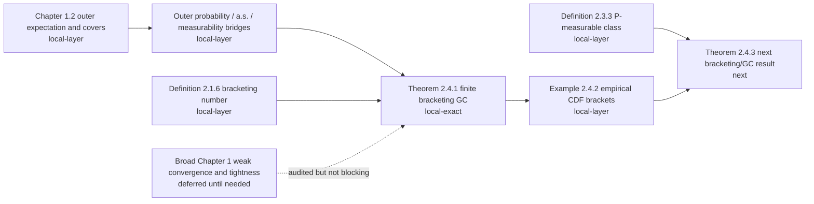

# VdV&W Chapter 1-2 Progress Dashboard

This dashboard is a quick visual view of the current formalization state for
van der Vaart and Wellner Chapters 1 and 2.  The authoritative detailed
inventory is `docs/vdvw_chapter1_2_formalization_blueprint.md`; this file is a
human-facing monitor for what is proved, what is in progress, and what remains.

Status snapshot date: 2026-05-02.

Active blocker/primitives register:

```text
docs/vdvw_current_blocker_primitive_plan.md
```

## Status Legend

| Status | Meaning |
| --- | --- |
| `local-exact` | The exact textbook theorem/lemma target is formalized and proved in Lean with no proof holes. |
| `local-layer` | A compiled local proof layer exists, but the exact textbook item still has compatibility gaps. |
| `mathlib-foundation` | Pinned mathlib has reusable foundations, but the exact VdV&W statement is not locally proved. |
| `pending-local` | No exact local Lean proof yet. |
| `deferred` | Audited, but not a near-term blocker unless a concrete empirical-process theorem depends on it. |
| `deferred-example` | Example/addendum intentionally skipped for now because it needs external-domain formalization outside the current Chapter 1-2 main line. |

## Global Theorem-Level Inventory

The Chapter 1-2 theorem-level extraction currently has 156 items.

```text
local-exact       1 / 156  [#-----------------------------]
local-layer       7 / 156  [#-----------------------------]
mathlib-found.   21 / 156  [####--------------------------]
pending-local   127 / 156  [########################------]
```

The bars are inventory bars, not effort estimates.  A `pending-local` item may
be deferred if it is broad Chapter 1 infrastructure rather than a dependency of
the current empirical-process target.

Examples/addenda are tracked separately from this theorem-level inventory.
The current examples/addenda frontier has two compiled local layers: Example
2.3.4 pointwise/countable-subclass convergence helpers and supremum-equality
handoff to `P`-measurability, and Example 2.4.2 half-line bracket membership, width,
extended-real endpoint brackets, extended-open-cell endpoint/width identities,
probability-measure CDF/Stieltjes open-cell identity and CDF-increment
middle-cell handoffs, finite-measure real-tail
cutpoints, adjacent-endpoint grid handoff, supplied
finite-grid bridges, the one-cell base
grid and one-cell adjacent-endpoint base grid for radii above total mass,
radius-monotonicity helpers for supplied real/extended/adjacent-endpoint grids,
finite-real-endpoint assembly constructor,
three-cell endpoint-grid constructor from supplied tail/middle width bounds,
three-cell CDF-increment handoff,
reduction of full endpoint-grid existence to the nontrivial range
`0 < epsilon <= μ.real univ`, direct nontrivial-range handoffs to
primitive-grid existence and all-positive-radius `N_[] < ∞`, the
conditional half-line GC corollary from supplied grids, and the conditional
half-line GC corollary from adjacent endpoint grids.

## Chapter Split

| Chapter | Total theorem-level items | local-exact | local-layer | mathlib-foundation | pending-local |
| --- | ---: | ---: | ---: | ---: | ---: |
| Chapter 1 | 47 | 0 | 7 | 17 | 23 |
| Chapter 2 | 109 | 1 | 0 | 4 | 104 |

Chapter 1 has more infrastructure layers than exact completions because many
statements are whole-book weak-convergence/tightness machinery.  Chapter 2 has
the current exact theorem milestone, Theorem 2.4.1.

## Main Formalization Path



## What Is Proved Exactly

| Textbook item | Lean status | Notes |
| --- | --- | --- |
| Theorem 2.4.1 | `local-exact` | Proved as `vdVW_theorem_2_4_1_glivenkoCantelli` in the book-style GC predicate. |

The Theorem 2.4.1 proof route includes primitive finite `L1(P)` bracketing
numbers, endpoint SLLN bridges, countable decreasing cover assembly, and
outer-a.s./outer-probability GC wrappers.

## Active Local Layers

| Textbook area | Current local Lean layer | Remaining gap before exact textbook item |
| --- | --- | --- |
| Lemma 1.2.1 | Nonnegative outer/inner expectation and measurable-cover interfaces | Full extended-real measurable-cover existence theorem. |
| Lemma 1.2.2 | Nonnegative cover algebra: sup, add majorant, product majorant, two-sided constant addition equality, finite-measurable addition equality, threshold indicators, two-sided measurable infimum equality | Full signed extended-real clauses, subtraction, absolute value, and stronger addition/product equality cases. |
| Lemma 1.2.3 | Nonnegative event indicator bridges for outer/inner probability, explicit measurable event-cover existence, arbitrary measurable set covers with integral equality, direct `toMeasurable` hull integral equality, complement-set-cover lower covers, direct complement-cover inner-probability equalities, outer-probability/outer-expectation bridge, and two-sided complement identities | Remaining extended-real and full measurable-set-cover clauses. |
| Definition 1.10.1 | Outer-probability convergence primitives and common-domain `TendstoInMeasure` bridge | Broader arbitrary-map API. |
| Lemma 1.10.2 | Measurable common-domain weak-convergence bridge | Full VdV&W arbitrary-map/measurable-cover version. |
| Definition 2.1.5 | `vdVWCoveringNumber` wrapper over mathlib `Metric.externalCoveringNumber`, explicit finite closed-ball cover witnesses, finite-number handoff, monotonicity, and packing comparison wrappers | Exact open-ball norm convention needs radius-slack wrappers when a theorem requires literal `< epsilon` balls. |
| Definition 2.1.6 | Primitive brackets, finite covers, `L1(P)` width, and numeric `l1BracketingNumber` | Entropy/logarithm refinements are not the current target. |
| Definition 2.2.3 | Semimetric whole-space covering/packing wrappers `vdVWSemimetricCoveringNumber` and `vdVWSemimetricPackingNumber`, finite-cover handoff, and `N <= D <= N(epsilon/2)` comparison layer | Entropy/logarithm wrappers and exact open-ball convention remain pending. |
| Definition 2.3.3 / Example 2.3.4 | Product measure `P^n`, display `(2.3.2)` weighted sample sums and class suprema, `NullMeasurable` predicate for measurability on the completion, countable coordinate-measurable constructor, pointwise-to-weighted-sum convergence helpers, value-set/boundedness infrastructure for real suprema, bounded pointwise-approximability-to-supremum-equality bridge, deterministic finite-cover supremum bound for Theorem 2.4.3, and proof-carrying countable-subclass supremum-equality handoff | Exact proof that the textbook pointwise convergence hypothesis implies all weighted-supremum equalities without extra boundedness assumptions, plus source screenshot for future theorem reports. |
| Example 2.4.2 | Real half-line indicator bracket membership, endpoint integrability, `L1(P)` width identity, extended-real endpoint indicators/brackets for `-∞`/`∞`, extended-open-cell endpoint/width identities, probability-measure CDF/Stieltjes open-cell identity and CDF-increment-to-middle-width handoffs, finite-measure real-tail cutpoints, adjacent-endpoint grid handoff, supplied finite-grid bridges, one-cell base grid and one-cell adjacent-endpoint base grid for radii above total mass, radius-monotonicity helpers for supplied real/extended/adjacent-endpoint grids, finite-real-endpoint assembly constructor, three-cell endpoint-grid constructor from supplied tail/middle width bounds and CDF increment bounds, bounded-middle CDF partition interface `SuppliedRealMiddleCDFPartition` with adjacent-endpoint strictness and open-cell width handoff, tail-appending endpoint constructor and endpoint-grid existence handoff from a supplied middle partition, reduction from uniform bounded middle partitions to full endpoint-grid existence, primitive-grid existence, and bracketing-number finiteness to `0 < epsilon <= μ.real univ`, all-positive-radius `N_[] < ∞` handoff, conditional half-line GC corollary from supplied grids, and conditional half-line GC corollary from adjacent endpoint grids | Distribution-dependent bounded middle CDF/quantile partition existence and exact empirical-CDF example report. |

## Near-Term Frontier

```text
DONE       Theorem 2.4.1: finite L1(P) bracketing numbers imply GC.
ONGOING    Chapter 1.2 local cover/probability layers needed by empirical processes.
ONGOING    Example 2.4.2: distribution-dependent middle-cell partition in the nontrivial radius range after tail cutpoints and conditional EReal-grid GC handoff.
NEXT       Theorem 2.4.3 and nearby Chapter 2 bracketing/GC results.
READY      Definition 2.1.5 covering-number primitive for Theorem 2.4.3 setup.
READY      Definition 2.2.3 semimetric covering/packing comparison layer.
READY      Definition 2.3.3 P-measurable class primitive, countable constructor, bounded Example 2.3.4 handoff, and deterministic finite-cover supremum bound.
DEFERRED   Broad Chapter 1 weak-convergence/tightness/process machinery until needed.
```

The exact current blocker and the next primitive declarations are maintained
in `docs/vdvw_current_blocker_primitive_plan.md`; this dashboard should not be
used as the only source for choosing the next low-level proof target.

## Verification Monitor

Latest proof-layer verification:

```text
lake build
Build completed successfully.

rg -n "\bsorry\b|\badmit\b|\baxiom\b|unsafe" . -g '*.lean' -g '!.lake/**'
No matches.
```

For the latest pushed proof-layer commit, use:

```text
git log --oneline -5
```

## Report Monitor

| Report folder | Status |
| --- | --- |
| `Reports/Theorem_2_4_1_Bracketing_GC/` | Existing exact-theorem report for Theorem 2.4.1. |
| Future `Reports/VdVW_<item>_<slug>/` | Created only after an exact textbook theorem or lemma is fully proved in Lean. |

Intermediate proof layers should update this dashboard and the blueprint, not
create formal theorem reports.
