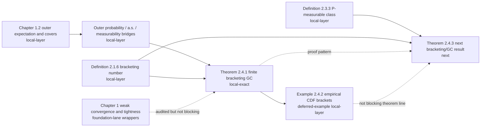

# VdV&W Chapter 1-2 Progress Dashboard

This dashboard is a quick visual view of the current formalization state for
van der Vaart and Wellner Chapters 1 and 2.  The authoritative detailed
inventory is `docs/vdvw_chapter1_2_formalization_blueprint.md`; this file is a
human-facing monitor for what is proved, what is in progress, and what remains.

Status snapshot date: 2026-05-03.

Active blocker/primitives register:

```text
docs/vdvw_current_blocker_primitive_plan.md
```

## Status Legend

| Status | Meaning |
| --- | --- |
| `local-exact` | The exact textbook theorem/lemma target is formalized and proved in Lean with no proof holes. |
| `local-layer` | A compiled local proof layer exists, but the exact textbook item still has compatibility gaps. |
| `mathlib-foundation` | Pinned mathlib has reusable foundations, but the exact VdV&W statement is not locally proved. |
| `pending-local` | No exact local Lean proof yet. |
| `foundation-lane` | Fundamental Chapter 1 item with a concrete mathlib-wrapper or local-primitive route. |
| `blocked-vdvw` | Exact VdV&W statement needs a missing arbitrary-map/nonmeasurable/perfect-map/representation primitive. |
| `deferred` | Audited and intentionally outside the current theorem line, with a recorded reason; not a substitute for mathlib search. |
| `deferred-example` | Example/addendum intentionally skipped for now because it needs external-domain formalization outside the current Chapter 1-2 main line. |

## Global Theorem-Level Inventory

The Chapter 1-2 theorem-level extraction currently has 157 items after the
Chapter 1 re-audit restored the missing Theorem 1.10.4 inventory row.

```text
local-exact        1 / 157  [#-----------------------------]
local-layer       11 / 157  [##----------------------------]
mathlib-found.    11 / 157  [##----------------------------]
ch1 foundation    25 / 157  [#####-------------------------]
blocked-vdvw       7 / 157  [#-----------------------------]
pending-local    101 / 157  [###################-----------]
```

The bars are inventory tags, not effort estimates.  The Chapter 1 foundation
lane is not a skip bucket: those rows should be formalized as mathlib-backed
wrappers or local primitive proofs.  Only `blocked-vdvw` records a genuine
missing exact VdV&W arbitrary-map/nonmeasurable/perfect-map/representation
primitive after local and pinned mathlib search.

Examples/addenda are tracked separately from this theorem-level inventory and
are no longer a main-line blocker.  The existing Example 2.3.4 and Example
2.4.2 compiled local layers remain reusable infrastructure, but exact example
reports and remaining example-specific external/domain-heavy closures are
deferred unless a theorem target needs them.

## Chapter Split

| Chapter | Total theorem-level items | local-exact | local-layer | mathlib-foundation | pending-local |
| --- | ---: | ---: | ---: | ---: | ---: |
| Chapter 1 | 47 | 0 | 10 | 17 | 20 |
| Chapter 2 | 109 | 1 | 1 | 4 | 103 |

Chapter 1 has more infrastructure layers than exact completions because many
statements are foundational weak-convergence/tightness/product/Hilbert
theorems that need mathlib-backed VdV&W wrappers or local primitives.  Chapter
2 has the current exact theorem milestone, Theorem 2.4.1.

## Main Formalization Path



## What Is Proved Exactly

| Textbook item | Lean status | Notes |
| --- | --- | --- |
| Theorem 2.4.1 | `local-exact` | Proved as `vdVW_theorem_2_4_1_glivenkoCantelli` in the book-style GC predicate. |

The Theorem 2.4.1 proof route includes primitive finite `L1(P)` bracketing
numbers, endpoint SLLN bridges, countable decreasing cover assembly, and
outer-a.s./outer-probability GC wrappers.

## Active Local Layers

| Textbook area | Current local Lean layer | Remaining gap before exact textbook item |
| --- | --- | --- |
| Lemma 1.2.1 | Nonnegative outer/inner expectation and measurable-cover interfaces, plus monotonicity of nonnegative outer and inner expectation | Full extended-real measurable-cover existence theorem. |
| Lemma 1.2.2 | Nonnegative cover algebra: sup, add majorant, product majorant, two-sided constant addition equality, finite-measurable addition equality, threshold indicators, tail-product cover-majorant for envelope-tail terms, two-sided measurable infimum equality, and measurable integrable real signed bridge via positive/negative outer expectations | Full arbitrary-map signed extended-real clauses, subtraction, absolute value, and stronger addition/product equality cases. |
| Lemma 1.2.3 | Nonnegative event indicator bridges for outer/inner probability, event-indicator monotonicity, explicit measurable event-cover existence, arbitrary measurable set covers with integral equality, direct `toMeasurable` hull integral equality, complement-set-cover lower covers, direct complement-cover inner-probability equalities, outer-probability/outer-expectation bridge, Markov-style outer-probability bound via supplied measurable cover, and two-sided complement identities | Remaining extended-real and full measurable-set-cover clauses. |
| Definition 1.3.3 / Theorem 1.3.4 / Theorem 1.3.6 / Theorem 1.3.9 / Section 1.4 | Measure-level weak convergence of probability measures, bounded-continuous and bounded-Lipschitz integral characterizations, Levy-Prokhorov distance characterizations, Portmanteau closed/open implications, probability-measure tightness compact-set characterization, Prokhorov compact-closure wrapper, continuous-map pushforward, binary and finite product-law weak convergence, finite-coordinate restriction/FDD forward wrapper, process-law and `IdentDistrib` uniqueness-only FDD wrappers, convergence-in-distribution continuous mapping, and measurable common-domain Slutsky/product convergence wrappers in `WeakConvergence.lean` and `FiniteDimensional.lean` | Full VdV&W arbitrary-map/nonmeasurable outer-expectation, asymptotic-measurability, asymptotic-tightness, asymptotic-independence, and FDD weak-convergence converse versions remain separate blocked primitives. |
| Lemma 1.7.1 | Open-ball and closed-ball sigma-field wrappers, open-ball topological basis, rational open/closed ball bridges, open-ball/closed-ball sigma equality, Borel equality, generator measurability, separable dense-sequence distance-coordinate measurability iff, and bounded distance-coordinate measurability iff in `BallSigma.lean` | Full arbitrary-map/asymptotic-measurability clauses remain pending. |
| Section 1.8 | Hilbert/L2/Gaussian foundation wrappers: complete inner-product spaces as Hilbert spaces, `L2` Hilbert space and inner product, Frechet-Riesz dual representative, Gaussian inner-coordinate maps, and Gaussian-process coordinate laws in `HilbertGaussian.lean` | Full VdV&W Hilbert tightness/asymptotic-measurability, Brownian bridge/pre-Gaussian, and functional CLT/Donsker statements still require local process primitives. |
| Definition 1.10.1 | Outer-probability convergence primitives and common-domain `TendstoInMeasure` bridge | Broader arbitrary-map API. |
| Lemma 1.10.2 | Measurable common-domain weak-convergence bridge | Full VdV&W arbitrary-map/measurable-cover version. |
| Definition 2.1.5 / Theorem 2.4.3 setup | `vdVWCoveringNumber` wrapper over mathlib `Metric.externalCoveringNumber`, explicit finite closed-ball cover witnesses, finite-number handoff, monotonicity, packing comparison wrappers, deterministic empirical `L1(P_n)` distance/finite-covering-number interface including nonempty-class positive-cardinality handoff, random sample-path empirical covering-number wrapper, random empirical-cover cardinality witness handoff, random empirical-cover product random-sign finite-net handoff, outer-probability `o_P^*(n)` entropy condition, `F_M` truncated-class/envelope interface, countable truncated-class `P`-measurability bridge, a.e./null-measurable cover constructors, truncated product-copy pair-difference measurability/integrability, `P.prod P` coordinate law/independence/identical-distribution wrappers, mapped truncated-class product-copy law/independence wrapper, finite-sample mapped-coordinate laws/independence wrapper, fixed-index product-copy mean-zero bridge, finite product-sample weighted-sum mean-zero bridge, conditional fixed-original-sample ghost-copy identity, fixed-sample `Phi(x)=x` ghost-copy comparison, product-copy pair-difference supremum split, envelope-bounded pair split, finite product-coordinate projection and expectation-level integral lifts, Fubini/product-projection centered handoff, deterministic weight sign-flip invariance, projected two-coordinate pair-difference expectation bound, composed centered-to-two-truncated-expectation handoff, deterministic Rademacher-weight sign-negation bridge, product-pair Rademacher sign-swap measure-preserving wrapper, integrated product-pair sign-symmetry and random-sign averaging comparisons, precursor random-sign expected-maximal and outer-expectation projections, supplied-`hphi_id` finite-net projection, product-integrated measurable-cover outer-expectation bridge, supplied product-space finite-net projection, sample-cover and sample-dependent-cardinality product-a.e. finite-net bridges, selected random-cover expected-maximal handoff, product-integrated random-cover finite-net expected-maximal bound, product outer-expectation projection for the expectation-level random-cover route, real-valued envelope-tail outer-expectation/probability bridge, ordinary measurable truncation-tail integral bridge, measurable-integrable outer/lintegral envelope-tail convergence, fixed-sample empirical-net inequality `(2.4.4)`, finite-center maximal/Hoeffding-scale handoff layer, deterministic and a.e. random Rademacher-sign finite-net specializations, one-center random Rademacher sub-Gaussian bridge, truncated-envelope variance-proxy arithmetic, sub-Gaussian proxy monotonicity, finite-center sub-Gaussian tail/union-bound layer, iid real-valued Rademacher-sign construction, finite-center supremum integrability layer, expected finite-center supremum handoff, layer-cake tail-integral monotonicity, generic ordinary dominated-convergence tail cutoff, bounded-tail expectation wrapper, product self-copy, mapped-coordinate joint-law independence wrappers, finite-`Pi` mapped-coordinate product wrappers, finite-`Pi` weighted-sum expectation wrappers, generic product-copy weighted-sum mean-zero wrapper, generic conditional ghost-copy finite-`Pi` Fubini wrapper, Gaussian-tail integrability, exact Gaussian-tail integral, coarse closed-form finite-center expectation bound, split-at-radius tail-to-expectation bound, Mills-type Gaussian-tail estimate, finite-center Mills expectation bound, supplied small-tail Mills simplification, logarithmic-radius arithmetic, finite-center logarithmic-radius Mills expectation bound, expected maximal-bound packaging, truncated Rademacher expected-maximal specialization, finite-empirical-cover expected-maximal wrapper, positive common-proxy lemma, proved log-radius-to-Hoeffding scale comparison, finite-empirical-cover expected-maximal wrapper at the Hoeffding display scale under explicit positivity, stochastic entropy-to-Hoeffding convergence, shifted-display and fixed/all-entropy Hoeffding convergence consumers, Markov outer-expectation-to-outer-probability bridge, variable-domain bounded outer-probability-to-mean bridge, finite-net mean consumer, and proof-carrying `VdVWTheorem243SymmetrizationPrecursor` package | The remaining gap is supplying boundedness/uniform-integrability input for the finite-net upper, then final convergence handoffs. The fixed-sample pointwise `hphi_id` and product-a.e. finite-center Hoeffding targets are too strong. Add nonmeasurable/arbitrary-cover envelope-tail variants only if the exact assembly needs them. |
| Definition 2.1.6 | Primitive brackets, finite covers, `L1(P)` width, and numeric `l1BracketingNumber` | Entropy/logarithm refinements are not the current target. |
| Definition 2.2.3 | Semimetric whole-space covering/packing wrappers `vdVWSemimetricCoveringNumber` and `vdVWSemimetricPackingNumber`, finite-cover handoff, and `N <= D <= N(epsilon/2)` comparison layer | Entropy/logarithm wrappers and exact open-ball convention remain pending. |
| Definition 2.3.3 / Example 2.3.4 | Product measure `P^n`, its probability-measure instance `instIsProbabilityMeasure_vdVWProductMeasure`, display `(2.3.2)` weighted sample sums and class suprema, `NullMeasurable` predicate for measurability on the completion, countable coordinate-measurable constructor, pointwise-to-weighted-sum convergence helpers, value-set/boundedness infrastructure for real suprema, bounded pointwise-approximability-to-supremum-equality bridge, deterministic finite-cover supremum bound for Theorem 2.4.3, and proof-carrying countable-subclass supremum-equality handoff | The theorem-relevant deterministic finite-cover handoff is available; exact example-only supremum equality is deferred unless needed by Theorem 2.4.3. |
| Example 2.4.2 | Real half-line indicator bracket membership, endpoint integrability, `L1(P)` width identity, extended-real endpoint indicators/brackets for `-∞`/`∞`, extended-open-cell endpoint/width identities, probability-measure CDF/Stieltjes open-cell identity and CDF-increment-to-middle-width handoffs, finite-measure real-tail cutpoints, adjacent-endpoint grid handoff, supplied finite-grid bridges, one-cell base grid and one-cell adjacent-endpoint base grid for radii above total mass, radius-monotonicity helpers for supplied real/extended/adjacent-endpoint grids, finite-real-endpoint assembly constructor, three-cell endpoint-grid constructor from supplied tail/middle width bounds and CDF increment bounds, bounded-middle CDF partition interface `SuppliedRealMiddleCDFPartition` with adjacent-endpoint strictness and open-cell width handoff, tail-appending endpoint constructor and endpoint-grid existence handoff from a supplied middle partition, reduction from uniform bounded middle partitions to full endpoint-grid existence, primitive-grid existence, and bracketing-number finiteness to `0 < epsilon <= μ.real univ`, all-positive-radius `N_[] < ∞` handoff, conditional half-line GC corollary from supplied grids, and conditional half-line GC corollary from adjacent endpoint grids | Deferred example-specific blocker: distribution-dependent bounded middle CDF/quantile partition existence and exact empirical-CDF example report. |

2026-05-03 update: the selected random empirical-cover witness now also feeds
the expectation-level finite-net route via
`vdVWTheorem243_truncated_rademacher_expectedMaximalBound_le_finiteNetHoeffdingUpper_of_randomEmpiricalL1CoverAtCard_of_pos`
and
`integral_prod_vdVWWeightedClassSupremum_le_integral_finiteNetHoeffdingUpper_add_of_randomEmpiricalCovers_expectedMaximal`.
The product outer-expectation projection for this route is also compiled as
`VdVWOuterExpectation_prod_vdVWWeightedClassSupremum_le_ofReal_integral_finiteNetHoeffdingUpper_add_of_randomEmpiricalCovers_expectedMaximal`.
The entropy-to-Hoeffding-scale algebra now also has
`vdVWTheorem243FiniteNetHoeffdingUpper_nonneg`,
`vdVWTheorem243FiniteNetHoeffdingUpper_sq`,
`vdVWTheorem243FiniteNetHoeffdingUpper_eq_logCardinality`,
`vdVWTheorem243FiniteNetHoeffdingUpper_sq_eq_logCardinality`,
`tendsto_sqrt_one_add_mul_sqrt_six_div_of_div_tendsto_zero`,
`tendsto_finiteNetHoeffdingUpper_of_logCardinality_div_tendsto_zero`, and
`VdVWTheorem243TruncatedEntropyCondition.fixed_of_forAllEpsilonM`.
The stochastic outer-probability entropy-to-Hoeffding-scale handoff is now
compiled as
`vdVWTheorem243FiniteNetHoeffdingUpper_convergesInOuterProbability_zero_of_logCardinality_littleO_n`,
with shifted-display and fixed/all-entropy consumers, and
`VdVWConvergesInOuterProbability_zero_of_outerExpectation_tendsto_zero_ofReal`
now provides the Markov bridge from vanishing outer expectation to outer
probability, with variable-domain and supplied-bound variants added for the
canonical product sample spaces. The fixed-`M` centered-truncated convergence
handoff is compiled as
`VdVWTheorem243_fixedM_centered_truncated_convergesInOuterProbabilityConst_zero_of_integral_finiteNetHoeffdingUpper_add_tendsto_zero`.
The real-to-`ENNReal.ofReal` convergence bridge
`tendsto_two_mul_ofReal_zero_of_tendsto_zero` and real-mean consumer
`VdVWTheorem243_fixedM_centered_truncated_convergesInOuterProbabilityConst_zero_of_integral_finiteNetHoeffdingUpper_add_real_tendsto_zero`
are also compiled.  The deterministic covering-radius term is now split off by
`tendsto_integral_finiteNetHoeffdingUpper_add_coverRadius_of_tendsto_integral_finiteNetHoeffdingUpper`,
and the theorem-facing fixed-`M` consumer
`VdVWTheorem243_fixedM_centered_truncated_convergesInOuterProbabilityConst_zero_of_integral_finiteNetHoeffdingUpper_and_coverRadius_tendsto_zero`
uses separate finite-net mean convergence and cover-radius convergence inputs.
The bounded-tail expectation wrapper
`probability_integral_le_threshold_add_bound_mul_tail`, the variable-domain
bounded outer-probability-to-mean bridge
`tendsto_integral_of_VdVWConvergesInOuterProbabilityConst_zero_of_bounded_nonneg`,
and the finite-net mean consumer
`integral_finiteNetHoeffdingUpper_add_tendsto_zero_of_bounded_convergesInOuterProbabilityConst`
plus the pure finite-net mean consumer
`integral_finiteNetHoeffdingUpper_tendsto_zero_of_bounded_convergesInOuterProbabilityConst`
are now compiled. The variable-domain entropy-to-Hoeffding bridge
`vdVWTheorem243FiniteNetHoeffdingUpper_convergesInOuterProbabilityConst_zero_of_logCardinality_div_convergesInOuterProbabilityConst_zero`
and bounded entropy-to-integrated-mean consumer
`integral_finiteNetHoeffdingUpper_add_tendsto_zero_of_logCardinality_div_convergesInOuterProbabilityConst_zero_bounded`
with pure finite-net mean form
`integral_finiteNetHoeffdingUpper_tendsto_zero_of_logCardinality_div_convergesInOuterProbabilityConst_zero_bounded`
and measurable-cardinality consumer
`integral_finiteNetHoeffdingUpper_tendsto_zero_of_logCardinality_div_convergesInOuterProbabilityConst_zero_bounded_of_measurable_cardinality`
are compiled as well. The random finite-net upper measurability/integrability
packaging lemmas
`measurable_vdVWLogEmpiricalL1CoveringCardinality_of_measurable_cardinality`,
`measurable_vdVWTheorem243FiniteNetHoeffdingUpper_of_measurable_cardinality`,
and
`integrable_vdVWTheorem243FiniteNetHoeffdingUpper_of_measurable_cardinality_bound`
are also compiled. The remaining blocker is supplying measurable cardinality,
boundedness/UI input, and `coverRadius -> 0` from the entropy route, then final
assembly.
The product-integrated symmetrization route now also has the composed
random-cover finite-net integral bridge
`integral_vdVWWeightedClassSupremum_centered_const_ofReal_le_two_integral_finiteNetHoeffdingUpper_add_of_randomEmpiricalCovers_expectedMaximal`.

## Near-Term Frontier

```text
DONE       Theorem 2.4.1: finite L1(P) bracketing numbers imply GC.
ONGOING    Chapter 1.2 local cover/probability layers needed by empirical processes.
ONGOING    Theorem 2.4.3 and nearby Chapter 2 bracketing/GC results.
READY      Definition 2.1.5 covering-number primitive plus fixed-sample/random empirical L1(P_n) entropy, random empirical-cover cardinality witness handoff, nonempty-cover positive-cardinality handoff, F_M truncation interfaces, countable truncated-class P-measurability bridge, a.e./null-measurable cover constructors, truncated product-copy pair-difference measurability/integrability, P.prod P coordinate law/independence/identical-distribution wrappers, mapped truncated-class product-copy law/independence wrapper, finite-sample mapped-coordinate laws/independence wrapper, fixed-index product-copy mean-zero bridge, finite product-sample weighted-sum mean-zero bridge, conditional fixed-original-sample ghost-copy identity, fixed-sample Phi=x ghost-copy comparison, pair-difference supremum split, envelope-bounded pair split, finite product-coordinate projection and expectation-level integral lifts, Fubini/product-projection centered handoff, composed centered-to-two-truncated-expectation handoff, product-pair sign-symmetry and random-sign integrated averaging, random-sign expected-maximal and outer-expectation projections, supplied-hphi finite-net projection, product-integrated cover/projection handoff, sample-cover and sample-dependent-cardinality product-a.e. finite-net bridges, real-valued envelope-tail outer-expectation/probability bridge, ordinary truncation-tail integral bridge, measurable-integrable outer/lintegral envelope-tail convergence, fixed-sample empirical-net inequality (2.4.4), finite-center maximal/Hoeffding-scale handoff layer, deterministic and a.e. random Rademacher-sign finite-net specializations, one-center sub-Gaussian bridge, variance-proxy arithmetic, sub-Gaussian proxy monotonicity, finite-center tail/union-bound layer, iid real-valued Rademacher-sign construction, finite-center supremum integrability, expected finite-center supremum handoff, layer-cake tail-integral monotonicity, generic ordinary dominated-convergence tail cutoff, bounded-tail expectation wrapper, product self-copy, mapped-coordinate joint-law independence wrappers, finite-Pi mapped-coordinate product wrappers, finite-Pi weighted-sum expectation wrappers, generic product-copy weighted-sum mean-zero wrapper, generic conditional ghost-copy finite-Pi Fubini wrapper, Gaussian-tail integrability/evaluation, coarse closed-form expectation bound, split-at-radius tail-to-expectation bound, Mills-type finite-center expectation layers, logarithmic-radius arithmetic, finite-center logarithmic-radius Mills expectation bound, expected maximal-bound packaging, truncated Rademacher expected-maximal specialization, finite-empirical-cover expected-maximal wrapper, common-proxy positivity, proved log-radius-to-Hoeffding scale comparison, Hoeffding-scale expected-maximal wrapper under explicit positivity, finite-net Hoeffding upper nonnegativity/square/log-cardinality rewrites, finite-net upper measurability/integrability packaging, deterministic `L_n / n -> 0` to Hoeffding-scale convergence helper, pointwise finite-net notation convergence bridge, stochastic entropy-to-Hoeffding convergence, variable-domain entropy-to-Hoeffding convergence, shifted-display and fixed/all-entropy Hoeffding convergence consumers, Markov outer-expectation-to-outer-probability bridge, variable-domain bounded outer-probability-to-mean bridge, variable-domain fixed-M centered-truncated convergence handoff under a vanishing integrated finite-net upper, real-mean fixed-M convergence consumer, bounded entropy-to-finite-net mean consumer, and proof-carrying symmetrization precursor package for Theorem 2.4.3 setup.
NEXT       Supply measurable-cardinality and boundedness/UI input for the finite-net upper, then final Theorem 2.4.3 assembly.
READY      Definition 2.2.3 semimetric covering/packing comparison layer.
READY      Definition 2.3.3 P-measurable class primitive, countable constructor, bounded Example 2.3.4 handoff, and deterministic finite-cover supremum bound.
DEFERRED-EXAMPLE Example 2.4.2 exact quantile-grid closure and empirical-CDF report unless a theorem needs it.
FOUNDATION Chapter 1 weak-convergence/tightness/product/Hilbert wrappers are real proof targets.
BLOCKED    Exact arbitrary-map/nonmeasurable/representation layers need new primitives.
```

The exact current blocker and the next primitive declarations are maintained
in `docs/vdvw_current_blocker_primitive_plan.md`; this dashboard should not be
used as the only source for choosing the next low-level proof target.

## Verification Monitor

Latest focused verification includes the entropy bridge commit `b68a377` plus
the current local fixed-`M` centered-truncated convergence handoff.

```text
lake build StatInference.EmpiricalProcess.Theorem243
Build completed successfully.

git ls-files '*.lean' ':!.lake/*' | xargs rg -n --color never -e '\b(sorry|admit|axiom|unsafe)\b'
No matches.
```

For the latest pushed proof-layer commit, use:

```text
git log --oneline -5
```

## Report Monitor

| Report folder | Status |
| --- | --- |
| `Reports/Theorem_2_4_1_Bracketing_GC/` | Existing exact-theorem report for Theorem 2.4.1. |
| Future `Reports/VdVW_<item>_<slug>/` | Created only after an exact textbook theorem or lemma is fully proved in Lean. |

Intermediate proof layers should update this dashboard and the blueprint, not
create formal theorem reports.
